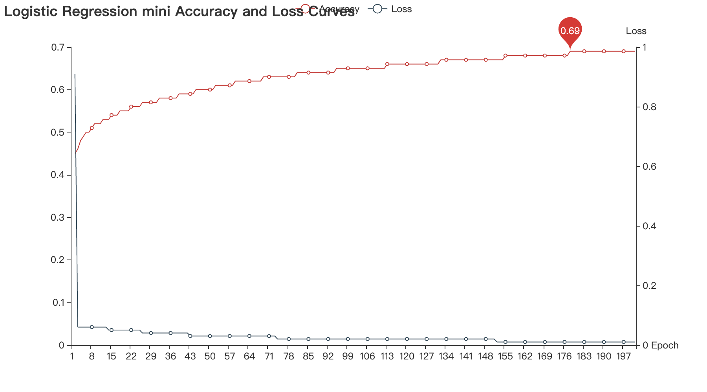
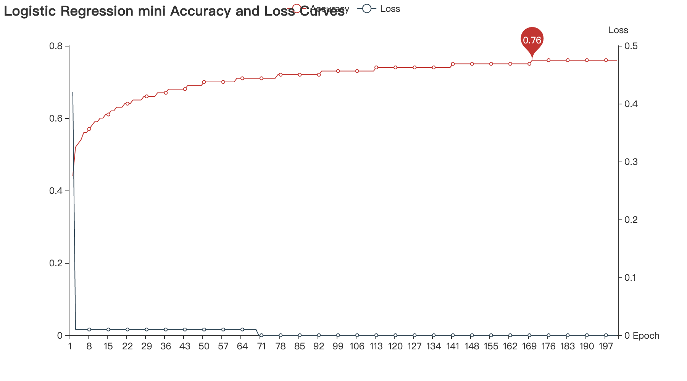
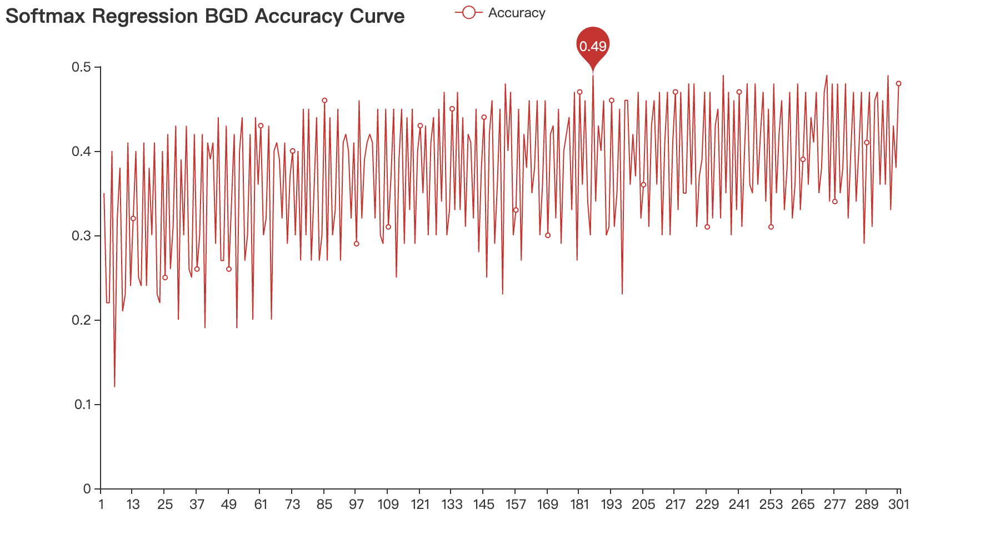
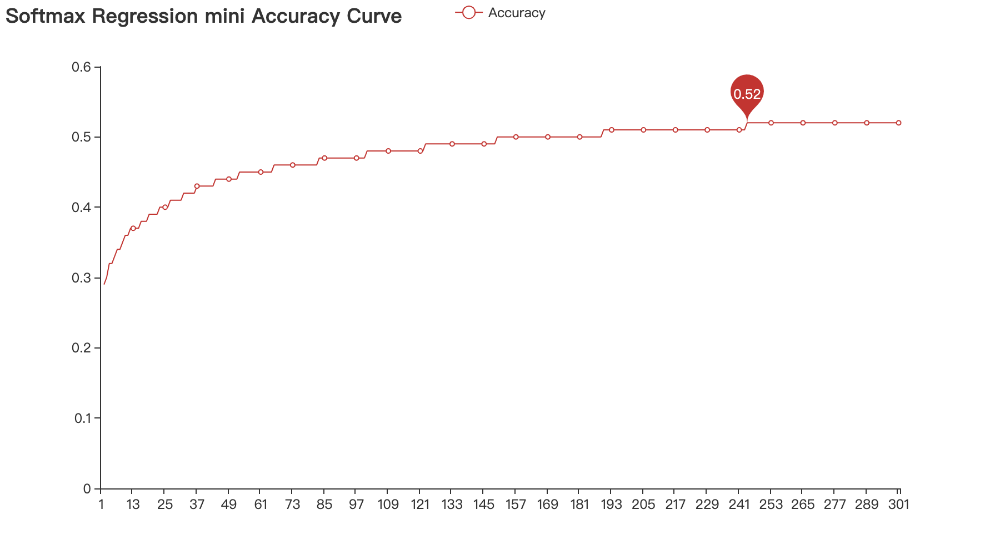
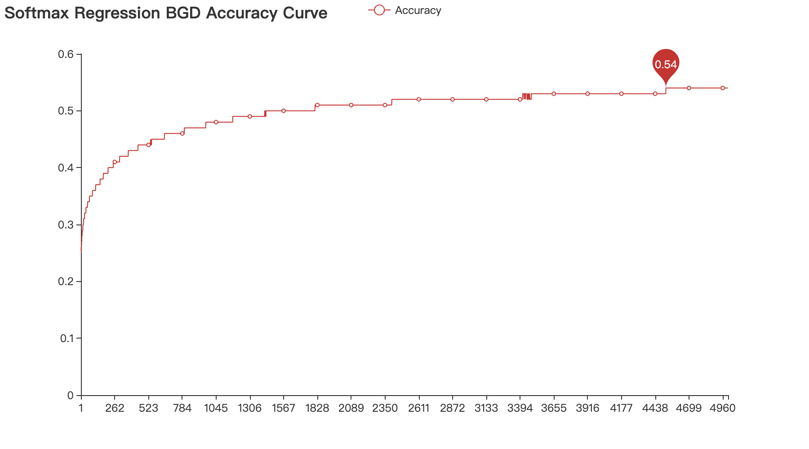
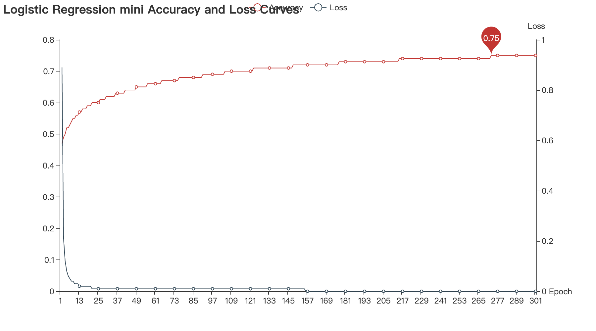
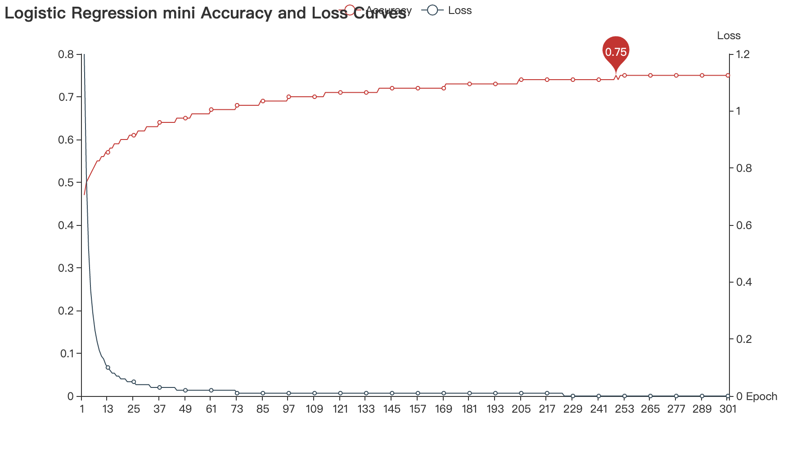

# 基于Numpy的文本分类

## 1. 预处理

###1.1 文本特征表示

(1) Bag-of-word和ngram: 将输入的句子，也就是$X$变量，用**Bag-of-word**的形式，同时结合**ngram**，构建包含unigram和bigram的稀疏矩阵。将输入的句子作为语料库，提取其中的unigram和bigram，统计其在每个句子中的出现次数，利用`scipy.sparse`库提供的`csr_matrix`构建稀疏矩阵。矩阵的行表示$x_i$(即数据集中的每个句子)，列表示所有的gram。$matrix[i][j]$表示$j$所指向的gram在$x_i$这句话中出现的次数。

(2) 函数

```python
def get_csr_matrix(self, data):
  ...
  return csr_matrix((nums, indices, indptr), dtype=int, shape=(len(data), len(self.token2id)))
```

### 1.2 数据集的划分及Shuffle

(1) 根据给定的比例，划分训练集、测试集和验证集，并且选择是否需要打乱数据集，这里我按照8:1:1的比例分割数据集，规模如下

```
Size of trainset: 124848
Size of testset: 15606
Size of devset: 15606
```

(2) 函数

```python
def split_dataset(X, Y, train_rate,test_rate, shuffle=SHUFFLE):
  ...
    index = [i for i in range(total)]  
    if shuffle:  # 打乱数据集
        random.shuffle(index)
  ...
  return X_train, Y_train, X_test, Y_test, X_dev, Y_dev
```

## 2. Logistic Regression

### 2.1 损失函数

(1) Logistic函数
$$
logistic(x)=\frac {L}{1+e^{-K(x-x_0)}}
$$
(2) Sigmoid函数

当参数$k=1,x_0=0,L=1$时，Logistic函数为标准Logistic函数，记为$\sigma (x)$，即我们俗称的Sigmoid函数
$$
Sigmoid(x)=\sigma (x)=\frac 1 {1+e^{-x}}
$$

```python
def sigmoid(self, x):  # sigmoid函数
    return 1.0 / (1 + np.exp(-x))
```

给定N个训练样本$\{(x^{(n)},y^{(n)}\}_{n=1}^N$，用Logistic回归模型对每个样本$x^{(n)}$进行预测，输出其标签为1的后验概率，记为$\hat y^{(n)}$
$$
\hat y^{(n)}=\sigma (w^Tx^{(n)})\\
\hat y^{(n)}=\frac 1 {1+e^{w^Tx^{(n)}}}
$$

```python
m, n = X.shape 
h = self.sigmoid(X.dot(self.W)) 
loss = (y.T.dot(np.log(h)) + (1 - y).T.dot(np.log(1 - h))) / (-m)
```

(3) 用交叉熵损失定义损失函数：
$$
L(w)=-\frac 1 N\sum_{n=1}^N(y^{(n)}log\hat y^{(n)}+(1-y^{(n)})log(1-\hat y^{(n)}))
$$

### 2.2 批量梯度下降（BGD）

(1) 对损失函数求关于参数$w$的偏导数，以此来迭代更新参数，其中$\alpha$为学习率
$$
dW=\frac {\partial{L(w)}}{\partial w} = -\frac 1 N\sum_{n=1}^Nx^{(n)}(x^{(n)}-\hat y^{(n)})\\
w_{t+1}=w_t-\alpha ·dW
$$

(2) 代码实现

```python
dW = X.T.dot((h - y)) / m  # 求导
self.W -= self.lr * dW  # 参数更新
```

### 2.3 Mini-batch梯度下降

(1) 核心思想是每次把训练集打乱后分成指定大小的batch，而每次求梯度的时候只对于这一个batch的数据求梯度更新参数。

(2) 函数

```python
def get_mini_batches(self,X, Y, mini_batch_size,seed=0):
  ...
  return mini_batches
```

(3) 参数更新

```python
for i in range(self.epoch):
    loss=0
    for batch_X, batch_Y in self.get_mini_batches(X_train,Y_train, self.batch_size):
        dW, loss = self.loss_func(batch_X, batch_Y)
        self.W -= self.lr * dW  # 参数更新
```

### 2.4 随机梯度下降（SGD）

与批量梯度下降不同的是，随机梯度下降每次只选取一个样本，在代码实现的过程中，将Mini-batch中的参数`batch_size`赋值为1即可。

## 3. Softmax Regression

### 3.1 损失函数

(1) Softmax 函数：对于𝐾 个标量$𝑥_1,⋯,𝑥_K$， Softmax函数定义如下，通过这个函数的计算，我们就可以把预测的结果映射到(0,1)之间，分子保证了概率的非负性，分母使得各种预测结果概率之和为1，即将所有结果相加，进行归一化。
$$
Softmax(x_k)=\frac{e^{x_k}}{\sum _{i=1}^ke^{x_i}}
$$
(2) 代码实现

```python
def softmax(self,x):
    return np.exp(x) / np.exp(x).sum(-1, keepdims=True)
```

(3) 损失函数定义

* 定义：假设有$N$个训练样本$\{(x^{(n)},y^{(n)})\}_{n=1}^N$,用交叉熵损失，定义损失函数如下，其中$C$表示类别总数，$y_c^{(n)}$为真实标签，与Logistic Regression不同的是，这里需要用one-hot来表示，$\hat y_c^{(n)}$为在给定样本$x^{(n)}$后的每个类别的预测值。

$$
\hat y_c^{(n)}=softmax(W^Tx^{(n)})\\
Loss(W) = -\frac 1 N\sum_{n=1}^N\sum_{c=1}^Cy_c^{(n)}log\hat y_c^{(n)}=-\frac 1 N\sum_{n=1}^N(y^{(n)})^Tlog\hat y_c^{(n)}
$$

* one-hot函数

  ```python
  def onehot(self,x, n_class):
      return np.eye(n_class)[x]
  ```

### 3.2 参数更新

(1) 更新过程：对$Loss(W)$求导数，以此更新梯度，其中$\alpha$为学习率。
$$
\frac {\partial L^{(n)}(W)}{\partial W}=dW=-x^{(n)}(y^{(n)}-\hat y_c^{(n)})\\
w_{t+1}=w_t-\alpha ·dW
$$
(2) 代码实现

```python
dW = -X.T.dot(self.onehot(y, self.n_class)- h)  # 求导
self.W -= self.lr * dW  # 参数更新
```

## 4. 实验

### 4.1 实验参数设置及其结果汇总

| Regression | Method             | EPOCH | SHUFFLE | BATCH_SIZE | LR   | Max_acc |
| ---------- | ------------------ | ----- | ------- | ---------- | ---- | ------- |
| Logistic   | 批量梯度下降       | 300   | True    | /     | 1    | 0.49    |
| Logistic | 批量梯度下降 | 1000 | False | / | 1 | 0.58 |
| Logistic   | mini_batch梯度下降 | 100   | True    | 1024       | 1    | 0.74  |
| Logistic   | mini_batch梯度下降 | 200   | True    | 1024       | 0.5  | 0.69 |
| Logistic | mini_batch梯度下降 | 200 | True | 1024 | 5 | **0.8** |
| Logistic   | 随机梯度下降       | 15    | True    | 1          | 1    | 0.78    |
| Logistic   | mini_batch梯度下降 | 200   | False   | 1024       | 2 | 0.76 |
| Logistic   | 随机梯度下降       | 15    | False   | 1          | 1    | 0.68    |
| Logistic   | 批量梯度下降       | 300   | False   | 1024       | 0.5  | 0.46    |
| Logistic   | 批量梯度下降       | 300   | False   | 1024       | 1    | 0.49    |
| Softmax    | 批量梯度下降       | 1000  | True    | /          | 0.00005 | 0.48    |
| Softmax | 批量梯度下降 | 5000 | True | / | 0.00005 | 0.54 |
| Softmax    | 批量梯度下降       | 10000 | True    | /          | 0.00005 | **0.55** |
| Softmax    | mini_batch梯度下降 | 1000  | True    | 1024       | 0.005   | 0.54    |
| Softmax    | mini_batch梯度下降 | 1000  | True    | 1024       | 0.0001  | 0.51    |
| Softmax    | 随机梯度下降          | 15    | False   | 1          | 0.005   | 0.49    |
| Softmax    | mini_batch梯度下降  | 2000 | False | 1024       | 0.0001 | 0.52 |

### 4.2 影响因素分析

这里将上述部分实验结果的训练过程分别从学习率、损失函数、Shuffle三个方面进行分析。

#### 4.2.1 学习率

如图1(a),1(b)所示，为学习率等于0.5和2的时候，训练过程中准确率和Loss的变化曲线，其他参数设置如下。

可以看到学习率等于0.5的时候准确率很多轮都没有变化，并且最后准确率也不如学习率等于2的时候高，曲线仍然有上升的空间，并未达到收敛。所以如果学习率设置比较小的话，可以适当增加训练轮次，以此达到收敛。另外，学习率等于2的时候在170轮的时候准确率已经达到0.7，说明梯度下降快。但是也不能盲目增加学习率，否则会导致训练过程反复横跳，下文会有这一情况出现。

| Regression | Method     | EPOCH | SHUFFLE | BATCH_SIZE |
| ---------- | ---------- | ----- | ------- | ---------- |
| Logistic   | mini_batch | 200   | True    | 1024       |


<center> 
   
  <br> <div style="color:orange; border-bottom: 1px solid #d9d9d9; display: inline-block; color: #999; padding: 2px;">
  图1(a) Learning rate=0.5</div> </center>


<center> 
   
  <br> <div style="color:orange; border-bottom: 1px solid #d9d9d9; display: inline-block; color: #999; padding: 2px;">
  图1(b) Learning rate=2</div> </center>


#### 4.2.2 Batch和mini_batch

如图2(a),2(b)所示，分别为用批量梯度下降和mini_batch梯度下降更新参数的训练过程，其他参数设置如下。

| Regression | LR     | EPOCH | SHUFFLE | BATCH_SIZE |
| ---------- | ------ | ----- | ------- | ---------- |
| Softmax    | 0.0005 | 300   | True    | 1024       |

可以看出mini_batch的效果要明显好于批量梯度下降，由图2(a)可得，批量梯度下降的学习率应该设置稍微小一点，否则会出现反复横跳的情况。

如图2(c)为批量梯度下降学习率等于0.00005, epoch=5000的情况。


<center> 
   
  <br> <div style="color:orange; border-bottom: 1px solid #d9d9d9; display: inline-block; color: #999; padding: 2px;">
  图2(a) 批量梯度下降, lr=0.0005</div> </center>


<center> 
   
  <br> <div style="color:orange; border-bottom: 1px solid #d9d9d9; display: inline-block; color: #999; padding: 2px;">
  图2(b) mini_batch梯度下降</div> </center>


<center> 
   
  <br> <div style="color:orange; border-bottom: 1px solid #d9d9d9; display: inline-block; color: #999; padding: 2px;">
  图2(c) 批量梯度下降，lr=0.00005</div> </center>


#### 4.2.3 SHUFFLE

如图3(a),3(b)所示，为以下参数设置的部分训练过程。

| 序号 | Regression | Method     | EPOCH | LR   | BATCH_SIZE | SHUFFLE | Max_acc |
| ---- | ---------- | ---------- | ----- | ---- | ---------- | ------- | ------- |
| 1    | logistic   | mini_batch | 300   | 1    | 1024       | True    | 0.75    |
| 2    | logistic   | mini_batch | 300   | 1    | 1024       | False   | 0.75    |
| 3    | logistic   | BGD        | 1000  | 2    | 1024       | True    | 0.59    |
| 4    | logistic   | BGD        | 1000  | 2    | 1024       | False   | 0.58    |
| 5    | logistic   | SGD        | 15    | 1    | 1          | True    | 0.77    |
| 6    | logistic   | SGD        | 15    | 1    | 1          | False   | 0.74    |

由变化曲线和最终的准确率来看，是否打乱数据集，对于mini_batch梯度下降和批量梯度下降影响不大，但是对于随机梯度下降有一定改善。因为批量梯度下降和mini_batch梯度下降是对于全部或者部分样本整体求导数，这样的话打不打乱其实没有意义。而随机梯度下降则不一样，每次只选取一个样本求梯度进而更新，打乱数据集可以使回归模型更具有鲁棒性。


<center> 
   
  <br> <div style="color:orange; border-bottom: 1px solid #d9d9d9; display: inline-block; color: #999; padding: 2px;">
  图3(a) 参数设置1</div> </center>


<center> 
   
  <br> <div style="color:orange; border-bottom: 1px solid #d9d9d9; display: inline-block; color: #999; padding: 2px;">
  图3(b) 参数设置2</div> </center>

&nbsp;

&nbsp;

&nbsp;

## 5. 总结

(1) 从实验结果来看，mini_batch梯度下降和随机梯度下降的效果比较好，通过我的观察，有时候在训练完第一轮，准确率已经达到0.5，而批量梯度下降训练300轮才达到0.49的准确率。同时，随机梯度下降训练时间较长，因为每一次都是选取其中一个样本更新参数，但是最终准确率较为可观。

(2) 通过训练曲线，可以适当调整学习率和epoch，如果曲线没有收敛，那么可以调大epoch，或者调大学习率，加快参数更新的速度；如果曲线反复横跳，说明学习率过大，应该适当减小学习率；如果曲线上升缓慢，也应该调大学习率。

(3) SHUFFLE对于随机梯度下降的影响较大，对于mini_batch梯度下降和批量梯度下降影响不大。

## 6. 参考

1. [pyecharts官方文档](https://pyecharts.org/#/zh-cn/intro)

2. [scipy.sparse.csr_matrix](https://docs.scipy.org/doc/scipy/reference/generated/scipy.sparse.csr_matrix.html#scipy-sparse-csr-matrix)

## 附录

### 环境配置

```
numpy == 1.20.1
pandas == 1.1.1
pyecharts == 1.8.1
scipy == 1.4.1
nltk == 3.5
```


### 目录结构

```c++
.task1
├── data                                      // 数据文件夹
│   ├── sampleSubmission.csv
│   ├── test.tsv                             // 测试数据
│   └── train.tsv                            // 训练数据
├── images                                    // 训练过程可视化
│   ├── Logistic\ Regression\ BGD.html
│   ├── Logistic\ Regression\ SGD.html
│   ├── Logistic\ Regression\ mini.html
│   ├── Softmax\ Regression\ BGD.html
│   ├── Softmax\ Regression\ SGD.html
│   ├── Softmax\ Regression\ mini.html
│   ├── 图1a.png
│   ├── 图1b.png
│   ├── 图2a.png
│   ├── 图2b.png
│   ├── 图2c.png
│   ├── 图3a.png
│   ├── 图3b.png
│   └── 图3c.png
├── main.py          // 主程序 修改其中的参数可以直接运行
├── models.py        // softmax regression和logistic regression模型
├── ngram.py         // ngram语言模型
└── utils.py         // 画图脚本
```

